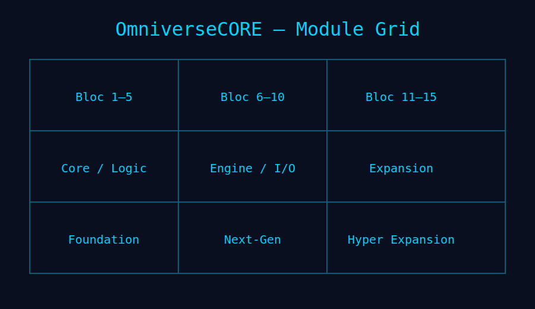
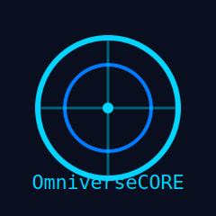

###### README.md >> markdown 
# 🚀 OmniverseCORE 
>Version 3.0 Hyper Expansion
- Universal Tech Framework
- By The MadDoG.tmdg

---

<p align="center">
  
</p>

---

### 🧬 Présentation
- OmniverseCORE est un framework technologique universel, modulaire, extensible et multi‑domaines.  
>La version 3.0 — Hyper Expansion introduit
```md
- API externe v1  
- Dashboard interne  
- Nouveaux blocs avancés (11 → 15)  
- Architecture étendue  
- CI/CD nouvelle génération  
- Documentation v3 complète
```

---

### 🏷️ Badges
<p align="left">
  
  
  
  
  
</p>

---

### 🌌 Domaines couverts
```md
- Optimisation système (Linux, Windows, macOS, Android)
- API REST / GraphQL / gRPC
- IA locale (GGUF, ONNX, pipelines ML, agents)
- Dashboard Web futuriste (React + TS + Tailwind)
- DevOps complet (Docker, K8s, Terraform, Ansible)
- Documentation multi-formats (MD, RST, MkDocs, OpenAPI)
- Marketplace de modules
- API externe v1 (v3.0)
- Dashboard interne (v3.0)
- Blocs avancés 11 → 15 (v3.0)
```

---

### 🧱 Architecture (v3.0)
<p align="center">
  
</p>

---

### 🧩 Module Grid (1 → 15)
<p align="center">
  
</p>

---

### ⚙️ Installation
```bash
bash scripts/bash/install.sh
```

### 🧠 Lancer l’IA
```bash
python3 core/ai/agents/agent.py
```

### 🖥️ Lancer le dashboard
```bash
cd dashboard
npm install
npm run dev
```

### 🔌 API REST
```bash
uvicorn core/api/rest/main:app --reload
```

---

### 🗺️ Roadmap

##### 🟧 v1.0 — Foundation
- Architecture initiale  
- Blocs 1 → 5  
- Documentation minimale  

##### 🟩 v2.0 — Next‑Gen Core
- Sécurité renforcée  
- I/O Layer v2  
- Documentation v2  
- Templates GitHub nouvelle génération  

##### 🟦 v3.0 — Hyper Expansion
- API externe v1  
- Dashboard interne  
- Blocs 11 → 15  
- CI/CD nouvelle génération  
- Documentation v3  

---

### 📜 Changelog (résumé)

##### v3.0
- Nouveaux blocs 11 → 15  
- API externe v1  
- Dashboard interne  
- Architecture étendue  

##### v2.0
- Security Layer  
- I/O Layer v2  
- Documentation v2  

##### v1.0
- Architecture initiale  
- Blocs 1 → 3  

---

### 🤖 CI/CD
>OmniverseCORE utilise un pipeline Next‑Gen
```md
- Build multi‑OS  
- Tests automatisés  
- Lint + format  
- Release auto  
- Tag auto  
- Changelog auto (Git‑Cliff)  
- Artefacts buildés
```

>Workflow :  
```text
.github/workflows/omniversecore-ci.yml
```

---

### 🤝 Contribution
Les contributions sont les bienvenues.  
Templates disponibles dans :
```text
.github/
├── ISSUE_TEMPLATE/
├── PULLREQUESTTEMPLATE/
└── DISCUSSION_TEMPLATES/
```

---

### 📄 Licence
- MIT

---

<p align="center">

🎯 Résultats
```md
- Ultra pro  
- Marketplace‑ready  
- Avec visuels intégrés  
- Avec badges  
- Avec architecture v3.0  
- Avec roadmap + changelog  
- Avec CI/CD  
- Avec installation + quickstart  
- Avec identité OmniverseCORE
```
<p/>

---

<p align="center">
  
  <p/>
